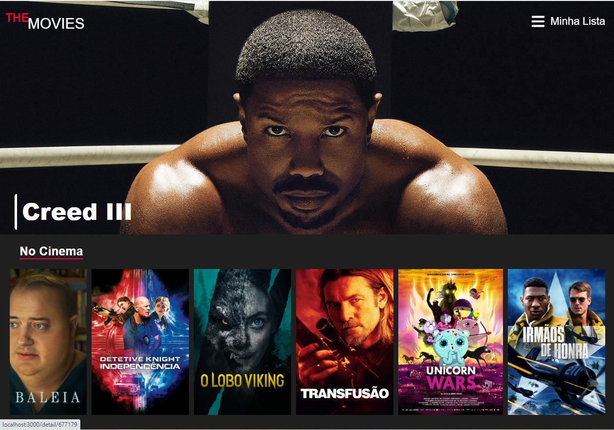
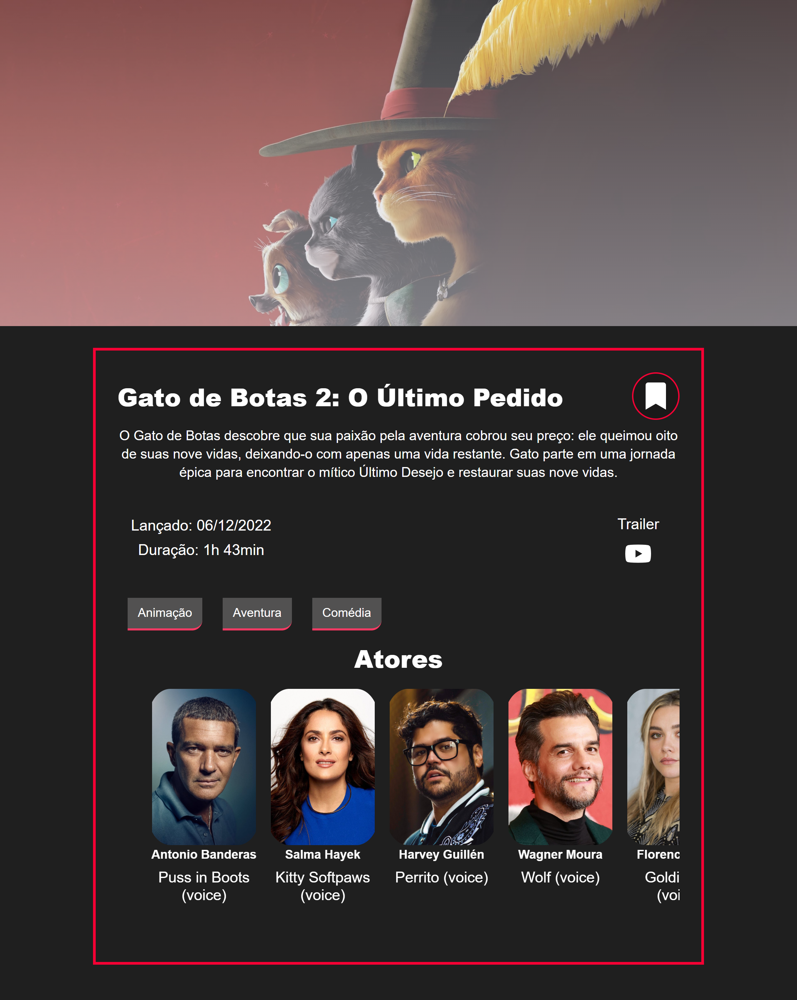
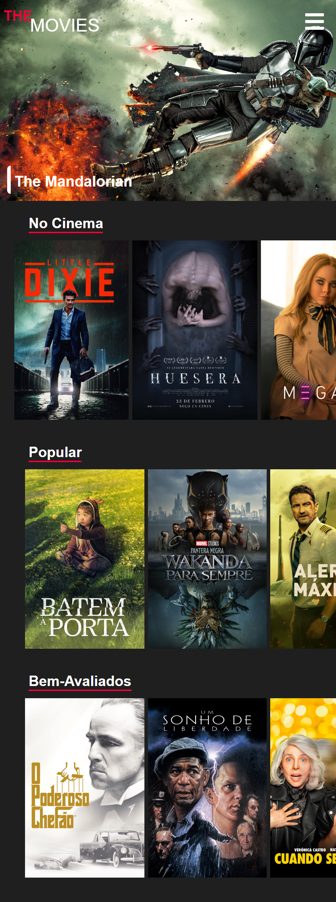

<h1 align="center">The Movies</h1>

## Sobre
Construí esse projeto com ReactJS totalmente responsivo que tem o objetivo de exibir listas de filmes que estão em cartaz no cinema, filmes populares e bem avaliados, também e possível ver as informações de cada filme e favorita os filmes de seu interesse.  
As informações dos filmes foram consumidas da API theMovieDB. 
[Documentação da api](https://www.themoviedb.org/documentation/api?language=pt-BR)

<h2 align="center">Layount 🖥️</h2>

## Tecnologias utilizadas 👨🏻‍💻
- React
- Axios
- React-Router-dom
- React-Icons
- React-toastify